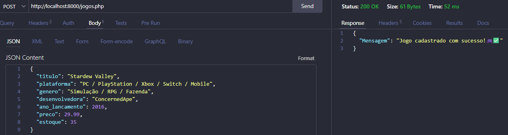
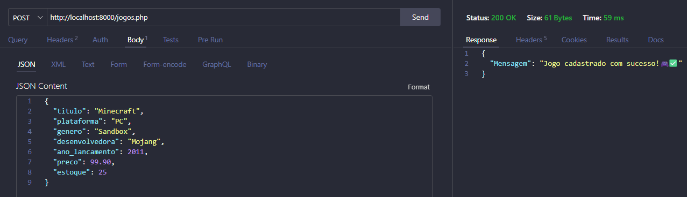
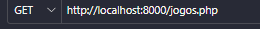
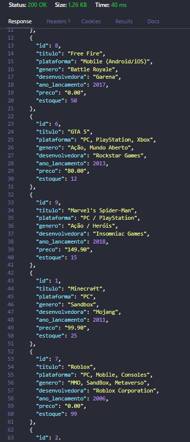
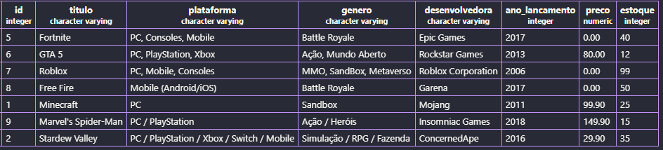

# 🎮 API de Catálogo de Games — Level Up Games

API desenvolvida para a **Level Up Games**, uma loja de jogos que vende pelo site e pelo Instagram.

O objetivo do projeto é **centralizar o catálogo de games em uma única API**, evitando divergências entre os canais de venda e problemas como a venda de jogos que já estão esgotados.

## 📌 Objetivo

Criar uma API de catálogo de games utilizando **PHP, PostgreSQL e JSON**, permitindo:

- Cadastrar jogos no banco de dados;
- Consultar todos os jogos cadastrados;
- Organizar os jogos em ordem alfabética pelo título;
- Centralizar as informações de catálogo e estoque.

---

## 🛠️ Tecnologias utilizadas

- **PHP**
- **PostgreSQL**
- **PDO**
- **JSON**
- **Thunder Client** para testes da API

---

## 📁 Estrutura do projeto

```text
levelup/
│
├── conexao.php
├── jogos.php
└── banco.sql
```

### `conexao.php`

Responsável por realizar a conexão da aplicação com o banco de dados PostgreSQL.

### `jogos.php`

Contém os endpoints da API para cadastro e consulta dos jogos.

### `banco.sql`

Contém o comando SQL utilizado para criar a tabela `jogos`.

---

# 🗄️ Banco de Dados

O banco de dados utilizado no projeto é:

```text
levelup
```

A tabela principal é:

```text
jogos
```

### Estrutura da tabela

| Coluna | Tipo | Descrição |
|---|---|---|
| `id` | INTEGER | Identificador do jogo |
| `titulo` | VARCHAR | Nome do jogo |
| `plataforma` | VARCHAR | Plataforma do jogo |
| `genero` | VARCHAR | Gênero do jogo |
| `desenvolvedora` | VARCHAR | Empresa desenvolvedora |
| `ano_lancamento` | INTEGER | Ano de lançamento |
| `preco` | DECIMAL | Preço do jogo |
| `estoque` | INTEGER | Quantidade disponível em estoque |


### Código Utilizado para Criação da Tabela
```php
CREATE TABLE produtos(
    id INT GENERATED ALWAYS AS IDENTITY PRIMARY KEY NOT NULL,
    titulo VARCHAR(60) NOT NULL,
    plataforma VARCHAR(60) NOT NULL,
    genero VARCHAR(60) NOT NULL,
    desenvolvedora VARCHAR(60) NOT NULL,
    ano_lancamento INT NOT NULL DEFAULT 0,
    preco NUMERIC(10,2) NOT NULL,
    estoque INT NOT NULL DEFAULT 0
);

```
---

# 🔌 API

A API possui dois métodos principais:

## POST — Cadastrar jogo

Utilizado para cadastrar um novo jogo no catálogo.

**Endpoint:**

```text
POST /jogos.php
```

### Exemplo de JSON:

```json
{
    "titulo": "Minecraft",
    "plataforma": "PC",
    "genero": "Sandbox",
    "desenvolvedora": "Mojang",
    "ano_lancamento": 2011,
    "preco": 99.90,
    "estoque": 25
}
```

### Resposta esperada:

```json
{
    "mensagem": "Jogo cadastrado com sucesso!🎮✅"
}
```

### Imagem de exemplo


---

## GET — Listar jogos

Utilizado para consultar todos os jogos cadastrados no banco de dados.

**Endpoint:**

```text
GET /jogos.php
```

Os jogos são retornados **em ordem alfabética pelo título**.

### Exemplo de resposta:

```json
[
    {
        "id": 1,
        "titulo": "Minecraft",
        "plataforma": "PC",
        "genero": "Sandbox",
        "desenvolvedora": "Mojang",
        "ano_lancamento": 2011,
        "preco": "99.90",
        "estoque": 25
    }
]
```

---

# 🧪 Testes

Foram realizados testes utilizando o **Thunder Client**.

A atividade solicita o cadastro de **5 jogos** e a realização dos testes dos métodos POST e GET.

## POST

Print do cadastro de um jogo realizado no Thunder Client:

### 📸 Resultado do POST



---

## GET

Print da listagem dos jogos cadastrados realizada no Thunder Client:

### 📸 Resultado do GET

### Exemplo:





### Resultado da Tabela

---

# 📦 Entrega

O projeto contém os arquivos e testes solicitados na atividade:

- ✅ Comando SQL da tabela;
- ✅ `conexao.php`;
- ✅ `jogos.php`;
- ✅ Cadastro de 5 jogos;
- ✅ Print do teste POST;
- ✅ Print do teste GET.

---

## 👩‍💻 Projeto acadêmico

**Atividade:** API de Catálogo de Games  
**Empresa fictícia:** Level Up Games  
**Tecnologias:** PHP + PostgreSQL  
**Objetivo:** Centralização do catálogo de jogos